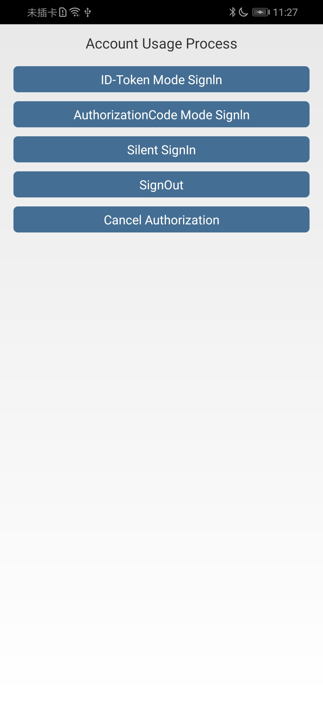

# 华为帐号服务客户端Java示例代码

中文 | [English](https://github.com/HMS-Core/huawei-account-demo/blob/master/Account-Client-Java-Demo/Account_Demo_AndroidStudio/README.md) 

## 目录
* [简介](#简介)
* [环境要求](#环境要求)
* [开发准备](#开发准备)
* [运行结果](#运行结果)
* [授权许可](#授权许可)

## 简介
Android示例代码对华为帐号服务（HUAWEI Account Kit）的客户端接口进行封装，包含丰富的示例程序，方便您参考或直接使用。详情如下：

hmssample：示例代码包，可实现登录、授权登录、静默登录、退出帐号和帐号取消授权功能。
logger：可实现日志记录。

## 环境要求
推荐使用Android SDK 23及以上版本、JDK 1.8及以上版本。

## 开发准备
1. 检查Android Studio开发环境是否就绪。在Android Studio中打开“build.gradle”文件所在的示例代码工程目录，并在您已安装最新版华为移动服务（HMS Core）的设备或模拟器上运行测试应用。
2. 注册[华为帐号](https://developer.huawei.com/consumer/cn/)。
3. 创建应用并在AppGallery Connect中配置相关信息。具体请参考[开发准备](https://developer.huawei.com/consumer/cn/doc/development/HMSCore-Guides/config-agc-0000001050196065)。
4. 构建此示例demo前，请先将demo导入Android Studio（3.0及以上版本）。
5. 配置示例代码：
     （1）在AppGallery Connect下载您应用的“agconnect-services.json”文件，将该文件拷贝到应用级根目录下。
     （2）修改示例工程中应用级“build.gradle”文件中的“applicationid”为您自己的应用包名。
6. 在Android设备或模拟器上运行您的应用。

## 运行结果
本示例代码提供了以下使用场景：
1. ID Token模式登录。
2. Authorization Code模式登录。
3. 静默登录。
4. 退出帐号。
5. 帐号取消授权。

## 授权许可
华为帐号服务Android示例代码经过[Apache License 2.0](http://www.apache.org/licenses/LICENSE-2.0)授权许可。
