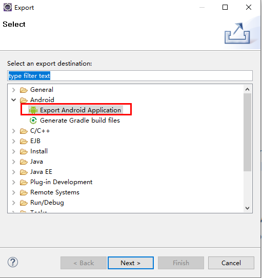
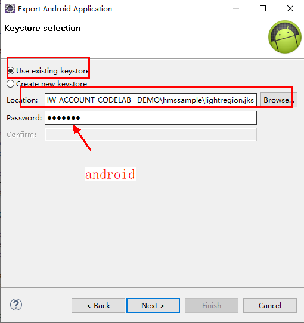
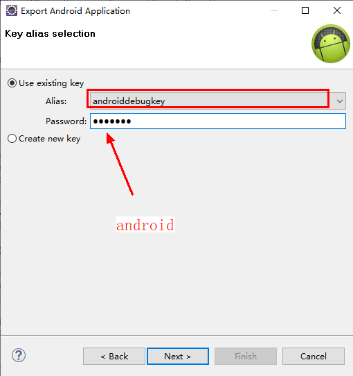
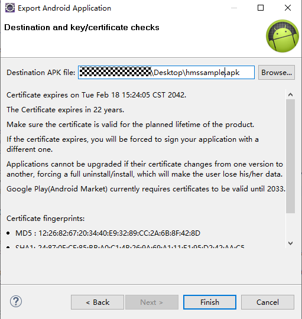
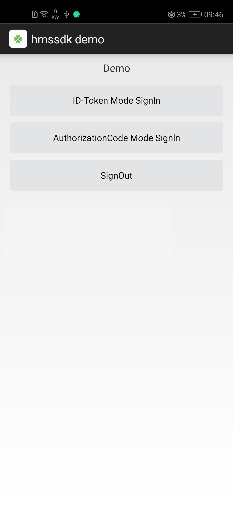

## Accountkit-Android-sample

## Table of Contents

 * [Introduction](#introduction)
 * [Installation](#installation)
 * [Configuration ](#configuration )
 * [Supported Environments](#supported-environments)
 * [Tutorial](#tutorial)
 * [Sample Code](#sample-code)
 * [License](#license)
 
 
## Introduction
Android sample code encapsulates APIs of the HUAWEI Account Kit server. It provides sample program for your reference or usage.
The following describes of Android sample code.

hmssample: Sample code packages. This package  contains code that implements Sign,  SignInCode and SignOut.
logger: This packages contains code that implements logger View.
    

## Installation
To use functions provided by examples, please make sure Huawei Mobile Service 4.0 has been installed on your cellphone.
## Supported Environments
Android SDK Version >= 23 and JDK version >= 1.8 is recommended.
	
## Configuration  
The following describes parameters in Contant.java
CLIENT_ID:  App ID, which can be obtained from AppGallery Connect website, please replace it with your app's client ID.
CERT_URL:  Request CERT_URL to get public key's URL from jwks_uri, then get public key.
ID_TOKEN_ISSUE:  The value that ISS string of ID Token should be equal to.
	
## Tutorial
1. Adding project dependencies.
Please refer to the [Adding Project Dependencies section of the Integrated HMS SDK in the Eclipse IDE](https://developer.huawei.com/consumer/en/doc/development/HMS-Guides/account-preparation)
2. Right-click the project in Eclipse IDE and click Export.
    
3. Click **Next** to enter keystore selection interface.
4. Select **Use existing keystore**， click **Browse**，select the **lightregion.jks** file in the your demo directory, and enter **android** in
   the password input box.
    
5. Select **Use existing Key**, select **androiddebugkey** in the Alias selection box, and enter **android** in the password box.
    
6. Click **Browser**, select the APK export location, and click **Finish**.
    
7. Install and start the demo, you should be able to see the following page.

    
	
	
## Sample Code
This demo provides demonstration for following scenarios:
1. ID-Token Mode Sign In.  Sign in and Id-Token verification are both included.
2. Authorization Code Mode Sign In. 
3. Sign out.

The business logic of ID-Token Mode Sign In and Authorization Code Mode Sign In are implemented in HuaweiIdActivity.java while Id-Token verification are implemented in  IDTokenParse.java.
    

##  License
Account-kit Android sample is licensed under the [Apache License, version 2.0](http://www.apache.org/licenses/LICENSE-2.0).
