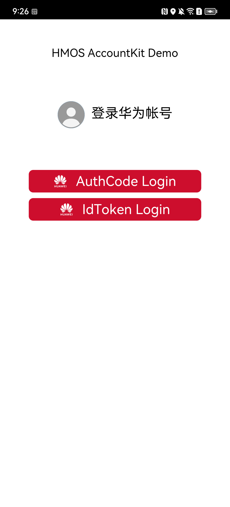

**HMOS_AccountKit_Demo**

## 目录
* [简介](#简介)
* [安装](#安装)
* [环境要求](#环境要求)
* [配置](#配置)
* [代码说明](#代码说明)
* [FAQ](#faq)
* [授权许可](#授权许可)
* [运行结果](#运行结果)

## 简介
本示例代码对华为帐号服务（HUAWEI Account Kit）常用接口在鸿蒙系统下快速入华为帐号提供了代码样例，方便您参考或直接使用。
示例代码包中演示了两种使用华为帐号快捷登录的方式：Authorization Code和ID Token模式。

## 安装
如需使用本示例代码中的各种功能，请确保您的设备上已安装华为移动服务（HMS Core）。

## 环境要求
* JDK 1.8 及以上版本
* IDE：DevEco Studio 3.1 Beta2
* HarmonyOS SDK： API9 版本

## 配置
* 在AppGallery Connect网站下载自己应用的"agconnect-services.json"文件，在工程的AppScope/resources/目录下创建rawfile文件夹，并将文件放入其中
* 修改示例工程中AppScope的"app.json5"文件中的"bundleName"为您自己的应用包名

## 代码说明
本Demo主要封装展示了Account SDK的相关能力。
主要类文件为：HuaweiAccountSDKProxy。

执行 Build -> Build Hap(s)/APP(s) -> Build Hap(s) 后在默认路径 entry/build/default/outputs/default 下会生成 *.hap 为签名的应用包文件

## FAQ
> 1.示例demo仅包含代码的业务逻辑，务必根据自身项目进行配置修改以下文件
* 添加 agconnect-services.json
* 修改 app.json5 中的 bundleName 字段

> 2.文件说明
```
entry  
  └─src
     └─main  
        └─ets  
            ├─hwid  
            │  └─HuaweiAccountSDKProxy.ts   --  华为帐号登录授权的流程
            └─pages
               └─Index.ets  --- 页面逻辑
```

> 3.调用华为帐号接口前，请确保调用了'@hms-core/framework-base-ohos'中的初始化应用信息方法：HMSClient.attachAbilityContext

> 4.无法通过IDE下载NPM仓上所依赖的 '@hms-core/account' SDK时，可以使用本地包。例如将SDK包放入./entry目录下，修改./entry/oh-package.json里dependencies字段如下，并点击右上角`Sync Now`或通过菜单栏`File -> Sync and Refresh Project`：
```
"dependencies": {
	...
	"@hms-core/account": "file:./account-6.10.1-300.tgz",
	...
}
```

> 5.本示例代码基于HarmonyOS SDK 3.2.5.6版本编译，有关API9各版本接口变更详细说明请参考[API变更说明](https://developer.harmonyos.com/cn/docs/documentation/doc-releases/changelog-api-9-beta1-ability-0000001464917706#section1954892114152)。

## 授权许可
华为帐号示例代码经过[Apache License 2.0](http://www.apache.org/licenses/LICENSE-2.0)授权许可。

## 运行结果

